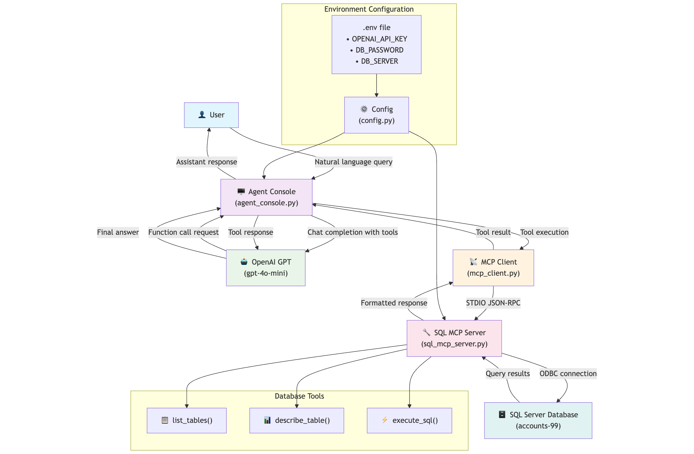

# SQL AI Agent with MCP

An AI agent that connects to SQL Server databases using OpenAI and the Model Context Protocol (MCP) for natural language database queries.

## Architecture



*Clean, streamlined architecture with direct communication between components*

## Features

- **Natural Language Queries**: Ask questions about your database in plain English
- **Comprehensive Database Tools**: List tables, describe schemas, execute SQL queries
- **Real-time Results**: Formatted output showing database results
- **Secure Configuration**: Environment-based secrets management

## Data Flow

```
User Query → OpenAI GPT → Function Calling → MCP Server → SQL Server → Results → Response
```

## Prerequisites

- Python 3.8+
- SQL Server with ODBC Driver 17 for SQL Server
- OpenAI API key

## Installation

1. **Clone the repository**
   ```bash
   git clone <your-repo>
   cd pmi-ai-testing
   ```

2. **Create virtual environment**
   ```bash
   python -m venv .venv
   source .venv/bin/activate  # On Windows: .venv\Scripts\activate
   ```

3. **Install dependencies**
   ```bash
   pip install -r requirements.txt
   ```

## Configuration

### Environment Variables Setup

Create a `.env` file in the project root with the following configuration:

```env
# OpenAI Configuration
OPENAI_API_KEY=your_openai_api_key_here

# Database Configuration
DB_SERVER=localhost
DB_NAME=SalesAnalytics
DB_USER=sa
DB_PASSWORD=your_database_password
DB_PORT=1433
```

### Required Environment Variables

| Variable | Description | Default | Required |
|----------|-------------|---------|----------|
| `OPENAI_API_KEY` | Your OpenAI API key | - | ✅ |
| `DB_PASSWORD` | Database password | - | ✅ |
| `DB_SERVER` | Database server hostname | `localhost` | ❌ |
| `DB_NAME` | Database name | `SalesAnalytics` | ❌ |
| `DB_USER` | Database username | `sa` | ❌ |
| `DB_PORT` | Database port | `1433` | ❌ |
| `OPENAI_MODEL` | OpenAI model to use | `gpt-4o-mini` | ❌ |
| `MAX_CONVERSATION_HISTORY` | Max conversation messages to keep | `50` | ❌ |

### Security Notes

- **Never commit your `.env` file** - it contains sensitive credentials
- Add `.env` to your `.gitignore` file
- Use environment variables in production instead of `.env` files

## Usage

### 1. Start the MCP Server

In one terminal:
```bash
python sql_mcp_server.py
```

### 2. Run the Agent Console

In another terminal:
```bash
python agent_console.py
```

### 3. Interact with Your Database

```
💬 SQL Assistant Ready! Ask me anything about the database (Ctrl-C to quit)

User > What tables are in the database?

▪ Executing list_tables({})
  → Found 15 tables:
    • dbo.Users
    • dbo.Orders
    • dbo.Products
    ...

Assistant > I found 15 tables in the database. The main tables include Users, Orders, and Products. Would you like me to describe the structure of any specific table?
```

## Project Structure

```
pmi-ai-testing/
├── agent_console.py      # Main chat interface
├── sql_mcp_server.py     # MCP server for database operations
├── config.py            # Configuration and constants
├── mcp_client.py        # MCP client communication
├── requirements.txt     # Python dependencies
└── .env                 # Environment variables (create this)
```

## Available Tools

The agent has access to three database tools:

1. **`list_tables()`** - Shows all tables in the database
2. **`describe_table(table_name)`** - Displays table schema and column details
3. **`execute_sql(query)`** - Runs any SQL query (SELECT, INSERT, UPDATE, DELETE)

## Example Queries

- "What tables exist in the database?"
- "Show me the structure of the Users table"
- "How many orders were placed last month?"
- "Who are the top 10 customers by total order value?"
- "Update the product price for item ID 123"

## Troubleshooting

### Common Issues

1. **ODBC Driver Missing**
   ```
   Install Microsoft ODBC Driver 17 for SQL Server
   ```

2. **Connection Failed**
   ```
   Check your database credentials in .env file
   Verify SQL Server is running and accessible
   ```

3. **Import Errors**
   ```bash
   pip install -r requirements.txt
   ```

### Logging

The MCP server logs all database operations. Check the server terminal for detailed connection and query information.

## Advanced Configuration

### Additional Environment Variables

For advanced SQL Server configurations, you can set these optional variables:

| Variable | Description | Default |
|----------|-------------|---------|
| `MSSQL_ENCRYPT` | Force TLS encryption (`true`/`false`) | `false` |
| `MSSQL_TRUST_SERVER_CERTIFICATE` | Accept self-signed certs (`true`/`false`) | `true` |
| `MSSQL_CONNECT_TIMEOUT` | Connection timeout in seconds | `30` |

### MCP Integration with Other Tools

The MCP server can be integrated with other MCP-compatible tools like Claude Desktop or Cursor. Add to your MCP configuration:

```json
{
  "mcpServers": {
    "MSSQL": {
      "command": "python",
      "args": ["/absolute/path/to/sql_mcp_server.py"],
      "env": {
        "DB_SERVER": "localhost",
        "DB_NAME": "accounts-99",
        "DB_USER": "sa",
        "DB_PASSWORD": "your_password"
      }
    }
  }
}
```

## Development

### Architecture Overview

The system follows a clean separation of concerns:

- **Agent Console**: Handles user interaction and OpenAI integration
- **MCP Transport**: STDIO-based JSON-RPC communication
- **SQL MCP Server**: Database operations with three main tools:
  - `list_tables()` - Database exploration
  - `describe_table(table_name)` - Schema inspection  
  - `execute_sql(query)` - Query execution
- **MCP Client**: Communication and result formatting

### Adding New Tools

1. Add tool function to `sql_mcp_server.py` with `@mcp.tool()` decorator
2. Update `FUNCTIONS_SPEC` in `config.py`
3. Add result formatting to `format_tool_result()` in `mcp_client.py`


### Adding New MCP Servers

The modular design makes it easy to add additional MCP servers (e.g., `redis_mcp_server.py`, `s3_mcp_server.py`) without touching the agent logic. Simply create a new server file and register it with your client configuration.

## License

MIT License - see LICENSE file for details. 